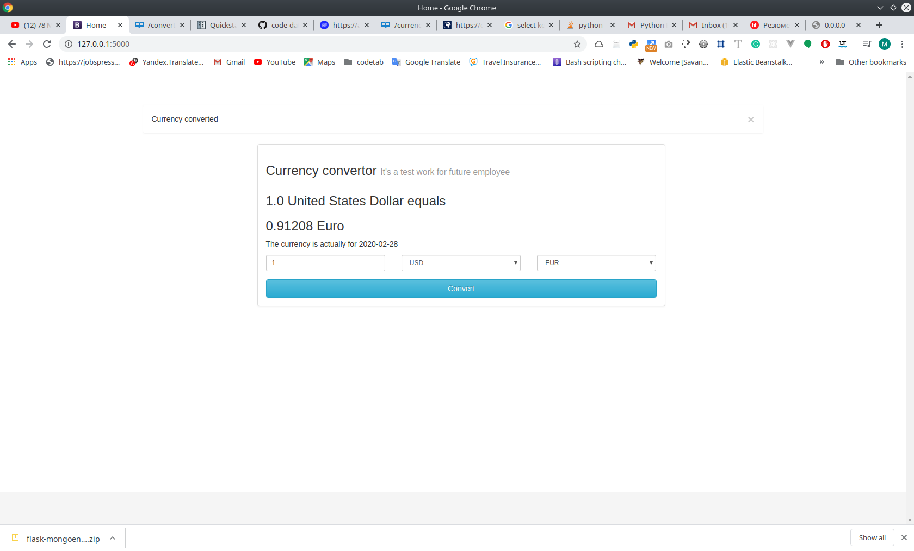

[](https://opensource.org/licenses/Apache-2.0)
## Install
```bash
git clone https://github.com/code-datum/currency-converter
cd currency-converter
virtualenv venv
source venv/bin/activate
pip install -r requirements.txt
python app.py # User interface http://0.0.0.0:5000
python api.py # REST API http://0.0.0.0:6000
```
Api command:
    conversion: http http://0.0.0.0:6000/api/v1/convert/12/USD/CAD
    Result:
```bash
HTTP/1.0 200 OK
Content-Length: 134
Content-Type: application/json
Date: Fri, 28 Feb 2020 10:57:05 GMT
Server: Werkzeug/1.0.0 Python/3.7.6

{
    "converted_value": 16.01897,
    "date": "2020-02-28",
    "from": "USD",
    "query": "/convert/12/USD/CAD",
    "to": "CAD"
}
```
get latest currency: http http://0.0.0.0:6000/api/v1/latest/base/USDhttp://127.0.0.1:5000/
```bash
HTTP/1.0 200 OK
Content-Length: 1036
Content-Type: application/json
Date: Fri, 28 Feb 2020 11:06:12 GMT
Server: Werkzeug/1.0.0 Python/3.7.6

{
    "base": "USD",
    "date": "2020-02-28",
    "rates": {
        "AUD": 1.520612915,
        "BGN": 1.7838380153,
        "BRL": 4.4668916454,
        "CAD": 1.3349142649,
        "CHF": 0.9692630427,
        "CNY": 7.0059284933,
        "CZK": 23.0600145932,
        "DKK": 6.8154870485,
        "EUR": 0.9120758847,
        "GBP": 0.7752188982,
        "HKD": 7.7942356804,
        "HRK": 6.8063662897,
        "HUF": 308.6191171105,
        "IDR": 14034.9963516965,
        "ILS": 3.4358810653,
        "INR": 71.6326158336,
        "ISK": 127.0521707406,
        "JPY": 109.8686610726,
        "KRW": 1211.0817219993,
        "MXN": 19.3908245166,
        "MYR": 4.2105071142,
        "NOK": 9.3869025903,
        "NZD": 1.5802626779,
        "PHP": 50.8637358628,
        "PLN": 3.9332360452,
        "RON": 4.3870850055,
        "RUB": 65.7654140825,
        "SEK": 9.6454761036,
        "SGD": 1.3949288581,
        "THB": 31.6499452754,
        "TRY": 6.1599781102,
        "USD": 1.0,
        "ZAR": 15.3611820503
    }
}

```
## Screenshots


